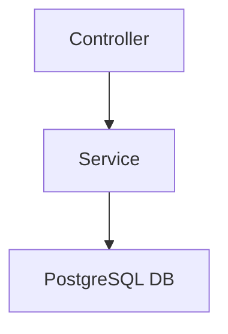

# MercedesPartsTracker_Api

An ASP.NET Core 8 Web API for managing Mercedes car parts inventory, bundled with infrastructure as code (Terraform), ,Dockerfile, and Docker Compose file.

---

## Included in This Repo

- **MercedesPartsTracker API** – ASP.NET Core REST API
- **Terraform Files** – Provision AWS RDS PostgreSQL & ECS Fargate (plan-only)
- **Dockerfile** – Build and package the API into a container
- **docker-compose.yml** – Spin up the PostgreSQL DB and API containers

---

## Setup Instructions

### Frontend React Repo
 ```bash
   git clone https://github.com/mohammedalli123/MercedesPartsTracker_React.git
````

### Running Locally (Dev)

**Prerequisite**:
Uncomment out the first part of the docker-compose.yaml file and comment out the send part. This will spin up the Postgres DB locally.

1. **Clone the repository**
   ```bash
   git clone https://github.com/mohammedalli123/MercedesPartsTracker_Api.git
   cd MercedesPartsTracker_Api

2. **Run the solution**  
Run within Visual Studio
    
### Running as a container (Docker)  
1. **Run the below  in the soltuion root to create a docker image for the API and and spin up both it's container as well as Postgres**  
    ```bash
    docker compose up --build  

## Architecture Overview



### Repository Pattern

##### Web API Controller
Handles incoming HTTP requests, performs initial validation, and delegates business operations to the Service Layer.

#### Business Logic Layer
This was omited due to time contraints but should be implemented to handle any business rule requirements.

##### Service Layer
Utilizes Entity Framework Core to interact with the database. It maps C# objects (Entities) to database tables and handles CRUD operations.

#### PostgreSQL Database
Stores the application's data.

## Rationale

The design of the `MercedesPartsTracker_Api` showcases **modularity**, **maintainability**, and **testability**.

### Separation of Concerns
By separating the Web API controller's responsibilities from the core business logic and data access (via a **Service Layer**), each component has a clear, single responsibility. This makes the codebase easier to understand, develop, and debug.

### Testability
The layered architecture greatly enhances unit testability:
- **Controllers** can be tested by mocking the **Service Layer**.
- **Services** can be tested by creating an in memory DB.

This ensures that each "unit" of code can be verified in isolation.

### Maintainability and Scalability
Changes to the database schema or underlying data access technology are primarily confined to the Service Layer.  
This modularity supports future scalability, allowing different layers to be deployed or scaled independently.

### Reusability
The **Service Layer** can be reused by other applications which need to interact with the same inventory data, promoting **code reuse** and **consistency**.

### Container with Docker
Using **Docker Compose** provides a consistent and isolated development and deployment environment.  
It simplifies setting up both the **database** and the **API**, ensuring that dependencies are managed reliably across different machines and environments.
